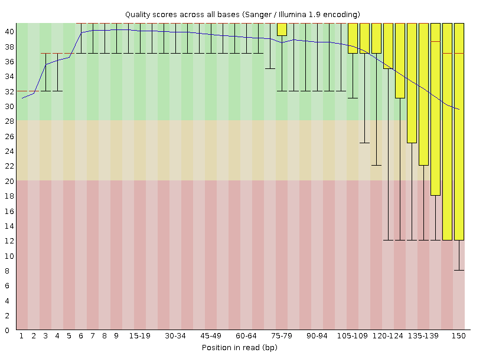
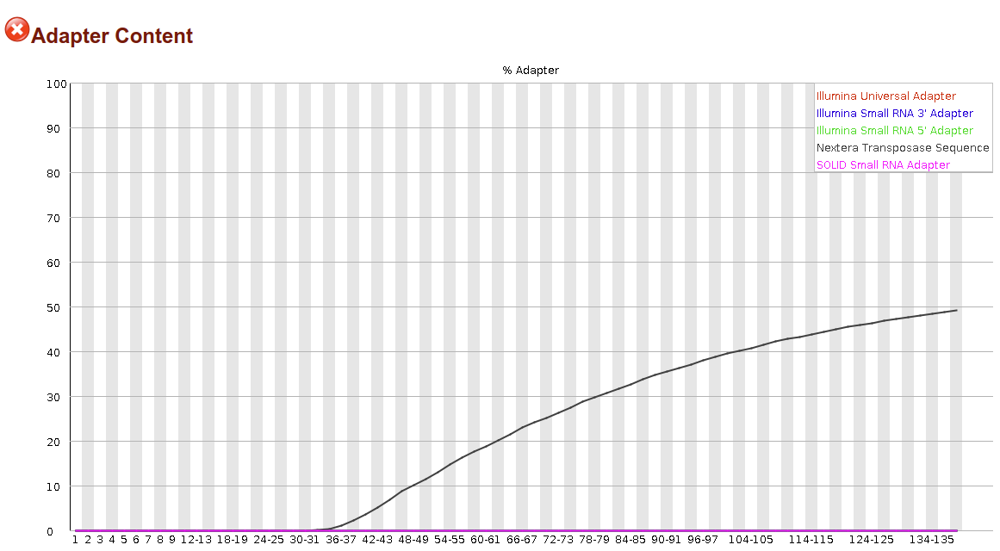
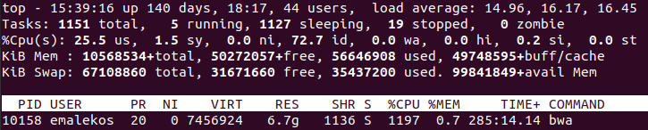
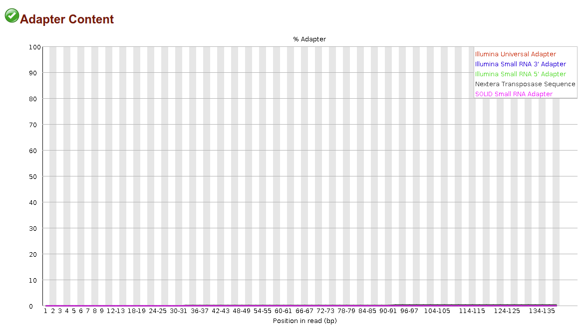

<link href="style.css" rel="stylesheet"></link>

<code>Created: 01-30-2021</code>  
<code>Updated: 02-17-2021</code>

hosted @ https://github.com/ericmalekos/RNASeq-walkthough  

# RNA Seq Walkthrough

## Introduction
**Purpose:**  provide a  step-by-step, end-to-end RNA Seq analysis walkthrough.  

**Environment:**
All commands and scripts are made to run on the UCSC <code>courtyard</code> server, but should work in any bash environment.  

|         |                  |
|:---|---:|
|OS:      | CentOS 7 |  
|Python: | 3.6.8  |
|Samtools:       | 1.9  |

If running on Windows try the [Linux Subsystem for Windows](https://docs.microsoft.com/en-us/windows/wsl/install-win10) or a Docker instance. Either of these can be used to create Linux environments on Windows (albeit with some drawbacks). I suspect any of the recent Ubuntu releases (16.04, 18.04, 20.04) should work.  

If using <code>courtyard</code> (or any remote server) it's **highly recommended** that you start commands in a <code>screen</code> environment. This is a very simple step and provides at least two substantial advantages:  

  1. A disruption to your <code>ssh</code> connection will not result in termination of whatever you're running. (Execution can take many hours to days so this is a likely occurrence)
  2. You can open multiple windows in the same terminal and switch between them, running different commands in each.  

In the examples below I will always be working in a <code>screen</code> window, however, I will only demonstrate how to start one in section <code>0.1</code>. If your <code>ssh</code> connection is broken use the command <code>screen -r</code> to reconnect.  
[More on using screen.](https://linuxize.com/post/how-to-use-linux-screen/)  

**The Data**: I will be using paired-end 151 bp Illumina sequence data starting in fastq.gz format.

**Note**: <code>fastq.gz</code> files often appear as <code>fq.gz</code>. If this is the case for your data and you're following this guide, you'll have to change the scripts to <code>fq.gz</code> wherever <code>fastq.gz</code> appears.

 

## Part 0: Getting the Data

In cases where it seems to make sense I will include the generic command followed by the command I am using for actual data as an example. Otherwise I will just show the command I am using. In the case of generic commands less-than, greater-than markers will be used EX: <code><data/directory></code>.

### 0.1 From an SFTP Server
0. Connect to courtyard, start a <code>screen</code> and navigate to your directory  

        $ ssh <username>@courtyard.gi.ucsc.edu
        $ ssh emalekos@courtyard.gi.ucsc.edu
        # enter password at prompt

        $ screen
        $ cd <directory/to/transfer/data/to>
        $ cd /public/groups/carpenterlab/people/emalekos/

1. Connecting to data storage on remote server  

        $ sftp <username>@<hostname>
        $ sftp emalekos@sftp.genewiz.com
        # enter password at prompt

2. We are now in an <code>sftp</code> environment (<code>$</code> -> <code>sftp></code>). We want to navigate to the data folder, use <code>ls</code> to list available directories

        sftp> ls
        30-422456969

        # Now I enter the folder I found above
        sftp> cd 30-422456969/
        sftp> ls
        00_fastq

        # Found another folder, I'll enter that.
        sftp> cd 00_fastq/
        sftp> ls -lh
        # This time I find the data files.

If you are in the data folder you should see something like:

        -rwxr--r--    ? 0        0            2.8G Jan  6 14:04 1M-Ctl-AM_R1_001.fastq.gz
        -rwxr--r--    ? 0        0            3.0G Jan  6 14:04 1M-Ctl-AM_R2_001.fastq.gz
        -rwxr--r--    ? 0        0            3.0G Jan  6 14:04 1M-LPS-AM_R1_001.fastq.gz
        -rwxr--r--    ? 0        0            3.1G Jan  6 14:04 1M-LPS-AM_R2_001.fastq.gz
        -rwxr--r--    ? 0        0            3.0G Jan  6 14:04 1W-Ctl-AM_R1_001.fastq.gz
        -rwxr--r--    ? 0        0            3.3G Jan  6 14:13 1W-Ctl-AM_R2_001.fastq.gz
        -rwxr--r--    ? 0        0            3.0G Jan  6 14:13 1W-LPS-AM_R1_001.fastq.gz
        -rwxr--r--    ? 0        0            3.2G Jan  6 14:13 1W-LPS-AM_R2_001.fastq.gz
        -rwxr--r--    ? 0        0            2.1G Jan  6 14:14 2M-CSE-AM_R1_001.fastq.gz
        -rwxr--r--    ? 0        0            2.3G Jan  6 14:14 2M-CSE-AM_R2_001.fastq.gz

1. To copy the files from this server to your workspace use the <code>get</code> command. Here I give some examples

        # To copy a single file
        sftp> get 1M-Ctl-AM_R1_001.fastq.gz

        # To copy all files
        sftp> get *

        # To copy all files ending in 'fastq.gz'
        sftp> get *fastq.gz

        # To copy all files with 'LPS' somewhere in the middle
        sftp> get *LPS*

        # To copy all files starting with 'LPS' and with '_R1' somewhere before the end
        sftp> get LPS*_R1*

**NOTE:** '<code>*</code>' performs wildcard expansion - it can fill in for any characters and is useful for pattern matching. When you use it it's good to check which patterns it's actually matching by double tapping the <code>Tab</code> key. This will list everything that matches. If you see the files you want press <code>Enter</code> to execute.

 

### 0.2 From Google Drive
You can use this method to transfer data files from your Google Drive account to <code>courtyard</code>. It works but is somewhat clunky, and there may be a better way. For instance this method transfers one file at a time, if all relevant files could be zipped together only one command would be required.

1. We will use the python package <code>gdown</code>. The first time you use this you will have to install it  

        pip3 install gdown --user

2. Get the share link for your Gdrive file
    - **IMPORTANT** - make sure the the file is accessible to "Anyone with the link"
    - The relevant part of the link is the string of characters between <code>/d/</code> and <code>/view/</code>
    - In the example below this is what we want: <code>1gc0Nfl693O49BECq34g6zno-ThJdBqw_</code>

    

3. Run with python3
    - Now you can start a python3 session and copy the files over

            $ python3

            # Now in python shell  
            >>> import gdown
            >>> url="https://drive.google.com/uc?id=1gc0Nfl693O49BECq34g6zno-ThJdBqw_"
            >>> output="desired_filename.fastq.gz"
            >>> gdown.download(url, output, quiet=False)

    - Alternatively you can open a text editor and write a script like this one (or copy the script from the gihub page).

            import gdown
            url_prefix = "https://drive.google.com/uc?id="
            suffix = ".fastq.gz"
            filedict = {"file_1_1" : "1gc0Nfl693O49BECq34g6zno-ThJdBqw_",
                        "file_1_2" : "<file 1_2 share link>",
                        "file_2_1" : "<file 2_1 share link>",
                        "file_2_2" : "<file 2_2 share link>"}

            for key, value in filedict.items():
                gdown.download(url_prefix + value, key + suffix, quiet=False)

        After changing the entries in <code>filedict</code> to your desired filenames and corresponding links, run with:

            python3 get_Gdrive.py

 

### 0.3 Make Smaller Files for Pipeline Practice (OPTIONAL)
You may want to practice running through the pipeline with a reduced dataset. This would allow you to troubleshoot much more quickly than if you tried processing all of your data at once. We can make some reduced, but still functional <code>fastq.gz</code> files with the following command

        zcat <file.in> | head -n <# of lines> | gzip > <file.out>

        zcat full_file.fastq.gz | head -n 10000000 | gzip > reduced_file.gz

This example takes the first <code>10000000</code> lines of the input file (or the first <code>2500000</code> fastq entries). The resulting gzipped file is ~200 MB. Adjust <code><# of lines></code> as you see fit, but make it divisible by 4 to avoid cutting off fastq entries.

 

## Part 1: Quality Control

Before going any further I'm going to organize my workspace.

        # move reads to a new directory
        $ mkdir raw_reads
        $ mv *.gz raw_reads

### 1.1 Read Quality with FastQC

FastQC seems to be the standard read quality checking tool. For each read file it generates an HTML file containing its findings. [More on FastQC.](https://linuxize.com/post/how-to-use-linux-screen/)

        # Download and unpack FastQC

        $ wget https://www.bioinformatics.babraham.ac.uk/projects/fastqc/fastqc_v0.11.9.zip
        $ unzip fastqc_v0.11.9.zip
        $ chmod +x FastQC/*
        $ rm fastqc_v0.11.9.zip

        # Make an output directory and run FastQC on all fastq.gz files

        $ mkdir quality_raw_reads
        $ for i in raw_reads/*fastq.gz; do FastQC/fastqc $i -o quality_raw_reads/ ; done

### 1.2 Viewing the FastQC Results

Now we want to view the HTML pages in a web browser. I don't know of an easy way to do this while the files are on the server. One option is to use <code>sftp get</code> as described above to move the files to your computer.

Here's an alternative that does not require downloading the files, but instead temporarily mounts the <code>quality_raw_reads</code> to your computer using <code>sshfs</code>. These commands are all run on your local computer, not <code>courtyard</code>

        # Install sshfs on *your* computer if you don't have it
        $ sudo apt install sshfs
        # enter password

        # make local mount directory and mount files to it
        $ mkdir mount

        $ sshfs <username>@courtyard.gi.ucsc.edu:<path/to/files> </mount/to>
        $ sshfs emalekos@courtyard.gi.ucsc.edu:/public/groups/shariatilab/emalekos/quality_raw_reads/ ./mount
        # Enter courtyard password

        # open a mounted file in your browser
        <browser> <mount/file.html>
        $ google-chrome mount/A01_1_fastqc.html

Here are my reads' quality scores for the first <code>fastq.gz</code> file.

And here is the adapter content

After viewing, unmount the files:

        $ fusermount -u <mounted_dir>
        $ fusermount -u mount

### 1.3 Trimming and Adapter Removal

Trimming low quality bases in Illumina reads is a common step in sequence alignment pipelines. However, modern aligners including HISAT2, BWA-MEM and STAR (which we will use in the next section) perform "soft clipping" which eliminates the need for additional trimming.  Using trimming tools in a way that is insensitive will likely reduce the mapping rate and can distort results.  
What about adapter removal? The author of STAR suggests it could be useful when [aligning short reads](https://github.com/alexdobin/STAR/issues/455) and the author of BWA suggests it [should be done](https://sourceforge.net/p/bio-bwa/mailman/bio-bwa-help/thread/530E1378.3040008%40cam.ac.uk/).

Good tools for adapter trimming are Trimmomatic, Cutadapt and NGmerge. Here I use NGmerge which determines the adapter sequences without user input which is nice. However, unlike the other two, it only works for paired-end reads.

        # get NGmerge
        $ git clone https://github.com/jsh58/NGmerge
        $ cd NGmerge
        $ make
        $ cd ..

        # make new directory for reads with adapters removed
        $ mkdir adapter_trimmed_reads

To run <code>NGmerge</code> on all of the <code>fastq.gz</code> files in <code>raw_reads/</code> you can copy this script.

        # Make file in nano text editor
        $ nano ngmerge_adapters.sh

        # Copy what's below with Ctrl + c and paste into nano file with Ctrl + Shift + v

        #!/usr/bin/env bash
        readDir=raw_reads/
        minRead=31
        threads=8
        maxQ=41
        outDir=adapter_trimmed_reads/
        outName=trim
        for i in ${readDir}*_1.fastq.gz
        do
                prefix=$(basename $i _1.fastq.gz)
                echo $prefix

                ./NGmerge/NGmerge \
                        -a \
                        -z \
                        -v \
                        -e $minRead \
                        -u $maxQ \
                        -n $threads \
                        -1 ${readDir}${prefix}_1.fq.gz \
                        -2 ${readDir}${prefix}_2.fq.gz \
                        -o ${outDir}${prefix}_${outName}
        done

Regarding the variables above the <code>for</code> statement   
        - If you have different directory names for reads and output you will need to change them.  
        - <code>minRead</code> is based on the FastQC adapter output which shows the adapters ending around base 31. Update this based on your FastQC results.  
        - <code>maxQ</code> is set to 41 because in Illumina >=1.8 the top quality score is 41 rather than 40.  
        - <code>threads</code> should be chosen with regard to the other jobs running on the server. See below for neighborly thread # setting  

 Once you've adjusted the variables, run the script:

        # Ctrl+o then Enter to save
        # Ctrl+x to exit nano

        # make script executable
        $ chmod +x ngmerge_adapters.sh

        # run script
        $ ./ngmerge_adapters.sh

This took a few hours when I ran it with the above settings on 10 sets of paired-end reads.

### 1.4 On Setting Threads

In the previous step, and going forward, we are going to be making use of a <code>threads</code> option in many of the tools we run. <code>threads</code> is short for "threads of execution" which, in this context, refers to a program performing some sort of data processing. In general a program uses a single thread of execution, but most bioinformatics tools allow the user to specify the number of threads. This is useful because the larger the number of threads, the more data can be processed in parallel, and the faster the operation can complete. However every computer has only a finite number of <code>threads</code>, probably between 4 and 16 on your personal computer, and 64 on <code>courtyard</code>. The <code>64 threads</code> are shared among all <code>courtyard</code> users so the number available to you will certainly be less than that. To check the current availability use:

        $ top

        # use Ctrl + c to exit top

You'll see something like:

I've cropped the image so that it only shows one running process - my <code>BWA</code> run - but you'll see all of the current processes.
The most important thing to note for the thread discussion is the <code>%Cpu(s)</code> number. Here it's at <code>25.5%</code> which means ~ 64 * 0.25 = 16 threads are in use, and 48 are available (also, under my <code>BWA</code> instance the <code>%CPU</code> is <code>1197%</code>, where 100% is equivalent to a single thread, so I must have run this with 12 threads).  The main thing is to be considerate when choosing threads and **NOT** contribute to a situation where <code>%Cpu(s)</code> becomes >= <code>100%</code>. This would add significant overhead as the server switches among processes and slow everyone's computation down.

### 1.5 QC Again

Here we repeat Parts 1.1 & 1.2, updating the path to point to the new QC files.

        $ mkdir quality_trimmed
        $ for i in adapter_trimmed_reads/*fastq.gz; do FastQC/fastqc $i -o quality_trimmed/ ; done

        $ sshfs emalekos@courtyard.gi.ucsc.edu:/public/groups/shariatilab/emalekos/quality_raw_reads/ ./mount

        $ google-chrome mount/A01_trim_1_fastqc.html

        $ fusermount -u mount

## Part 2: Mapping and Counting
When it comes to counting genes and transcripts there are two approaches:
1. Align reads to genome + counting
2. "Pseudo align" reads to transcriptome + quantification

The first (implemented in programs like STAR<, cufflinks and generally anything that produces a BAM/SAM file) has been the standard.  
**Pros:**  
   - produces BAM/SAM for downstream analysis  
   - often have additional features like marking novel splice junctions  
**Cons:**  
   - relatively slow and/or memory hungry  
   - Although fast by aligner standards, STAR requires ~32 GB of RAM when mapping to human genome
   - pseudo aligners on the other hand are often remarked to be runnable on a laptop 
   - maybe not as accurate as the pseudo aligners (although, of course, this doesn't seem to be straightforward)

The second (implemented in Salmon and Kallisto) is a newer method that relies on "pseudo-alignment" and seems to be increasingly popular. It compares reads to the transcriptome rather than the genome.  
**Pros:**
   - much less computationally demanding
   - may give better results in terms of both gene and transcript level quantification
   - Salmon and Kallisto are in remarkable agreement, uncommon for bioinformatics tools
   - made to deal with multimapping reads from the outset (I know STAR also has parameters that can be set in this regard, not sure about other aligners).  
**Cons:**
   - requires an annotated transcriptome
   - less compatible with many downstream tools - in particular those that require BAM/SAMs

### Part 2.2 STAR Alignment and Counting

STAR is a fast but memory hungry aligner (recommends at least 32 GBs for human genome) with a built in gene counting function yeilding the same results as *htseq* but saving a step by counting as it maps. It seems to be among the most popular transcript aligning tools. [More on *STAR*](https://github.com/alexdobin/STAR). Before mapping we need to build a genome index.
We need:
1. *STAR*
2. Annotation files (GTF or GFF)
3. Genome 

My data is from mouse, the files can be found [here](https://www.gencodegenes.org/mouse/release_M25.html). Note that the STAR documentation recommends using the <code>primary_assembly</code> (PRI) files. 

        # Make new directory and get STAR
        mkdir STAR
        cd STAR

        wget https://github.com/alexdobin/STAR/archive/2.7.7a.zip
        unzip 2.7.7a.zip

        cd STAR-2.7.7a/source
        make

        cd ../..

        # Annotation and Genome
        wget ftp://ftp.ebi.ac.uk/pub/databases/gencode/Gencode_mouse/release_M25/gencode.vM25.primary_assembly.annotation.gtf.gz
        
        wget ftp://ftp.ebi.ac.uk/pub/databases/gencode/Gencode_mouse/release_M25/GRCm38.primary_assembly.genome.fa.gz

        # Files need to be unzipped
        gunzip *.gz

Now we can create an index of the genome.

        mkdir M25_index

        STAR-2.7.7a/source/STAR\
                --runThreadN 8 \
                --runMode genomeGenerate \
                --genomeDir ./M25_index \
                --genomeFastaFiles ./GRCm38.primary_assembly.genome.fa \
                --sjdbGTFfile ./gencode.vM25.primary_assembly.annotation.gtf \
                --sjdbOverhang 150 \

The arguments in this step are pretty straightforward. You might change <code>--sjdbOverhang</code> based on your read lengths. The optimum choice is <code>length of longest read - 1</code>
Now we perform the alignment and gene counting in *STAR*.  
**NOTE**: The script provided will cycle through all of the pair end reads in the <code>readDir</code>. Currently it loads and unloads the genome into memory for every iteration of the loop which is inneficient. There is a way to load the genome once before entering the loop and unload it after but I was having trouble getting it to work.

        # First make some output directories
        for i in <reads_directory>/*<file_suffix>; do mkdir $(basename $i <file_suffix>) ; done
        for i in ../adapter_trimmed_reads/*_1.fastq.gz; do mkdir $(basename $i _1.fastq.gz) ; done

        ls
        # You should now see directories corresponding to each pair of reads

        # I call STAR from the script 'star_map_sort.sh':
        nano star_map_sort.sh

        threads=12
        readDir=../adapter_trimmed_reads/
        index=./M25_index/
        outDir=./

        for read in ${readDir}*_1.fastq.gz
        do
                base="$(basename "$read" _1.fastq.gz)"
                name1="$base"_1.fastq.gz   
                name2="$base"_2.fastq.gz
                echo
                echo First Read:  $name1
                echo Second Read: $name2

                outDir="$base"/
                echo Output Directory: $outDir

                STAR-2.7.7a/source/STAR \
                --genomeDir $index \
                --readFilesIn \
                ${readDir}/${name1} \
                ${readDir}/${name2} \
                --readFilesCommand zcat \
                --outSAMtype BAM SortedByCoordinate \
                --outSAMattributes NH HI AS nM XS \
                --twopassMode Basic \
                --outFilterMultimapNmax 10 \
                --quantMode GeneCounts \
                --runThreadN $threads \
                --alignEndsType Local \
                --outFileNamePrefix ${outDir}/${base}
        done

        # save and exit: CTRL + o, ENTER, CTRL + x

        chmod +x star_map_sort.sh

        ./star_map_sort.sh

The <code>echo</code> statements should give you some indication that you're pointing to the intended files/directories. Use <code>CTRL + c</code> to cancel the run if 
 
Arguments:  
- <code>readFilesCommand</code>: set to <code>zcat</code> if files are in <code>.gz</code> format, otherwise remove this
- <code>outSAMtype</code>: sorted BAM file.  
- <code>outSAMattributes</code>: attributes to include in alignment file. <code>NH HI AS nM</code> are standard.
              I include <code>XS</code> because I believe it is reequired for <code>juncBASE</code>.  
- <code>twopassMode</code>: default is single pass, <code>Basic</code> indicates to 2-pass mapping. I understand
              this to be preferred for considering splice junctions.  
- <code>outFilterMultimapNmax</code>: maximum number of loci the read is allowed to map to. 10 is default.
               reads that map to >10 loci are not included in BAM Alignment file.  
- <code>quantMode</code>: <code>GeneCounts</code> results in output file containing gene counts the same as <code>htseq-count</code> with
               default settings. All library combinations are accounted for (unstranded, first/second stranded)
               each as a separate column, so you need to pick the correct column from this output.
               See *STAR* manual/*htseq* manual for more info.  
- <code>runThreadN</code>: number of threads.  
- <code>alignEndsType</code>: alignmnent. Local is default and performs soft clipping.  
- <code>outFileNamePrefix</code>: there will be many output files. It's probably best to send output from each run to its own
               directory. This assigns the prefix to each.  

### Part 2.3 Salmon Pseudo-Alignment and Quantification

As with <code>STAR</code> we will build an index. 
We need:
1. *Salmon*
2. An annotated transcriptome
3. The primary genome assembly

        mkdir Salmon
        cd Salmon

        wget https://github.com/COMBINE-lab/salmon/releases/download/v1.4.0/salmon-1.4.0_linux_x86_64.tar.gz
        tar -xvf salmon-1.4.0_linux_x86_64.tar.gz

        rm *.gz

        # rename directory as "salmon"
        mv salmon-latest_linux_x86_64/ salmon

        #Download transcriptome and genome
        wget ftp://ftp.ebi.ac.uk/pub/databases/gencode/Gencode_mouse/release_M25/gencode.vM25.transcripts.fa.gz

        wget ftp://ftp.ebi.ac.uk/pub/databases/gencode/Gencode_mouse/release_M25/GRCm38.primary_assembly.genome.fa.gz

I copied the following code from [here](https://combine-lab.github.io/alevin-tutorial/2019/selective-alignment/)

        # Make a decoy file
        grep "^>" <(gunzip -c GRCm38.primary_assembly.genome.fa.gz) | cut -d " " -f 1 > decoys.txt

        sed -i.bak -e 's/>//g' decoys.txt

        # Create a new file combining transcriptome and genome, with transcriptome first
        cat gencode.vM25.transcripts.fa.gz GRCm38.primary_assembly.genome.fa.gz > gentrome.fa.gz

        salmon/bin/salmon index -t gentrome.fa.gz -d decoys.txt -p 12 -i salmon_index --gencode

Arguments:  
- <code>t</code>: transcriptome and genome concatenated file with which to build index.
- <code>d</code>: decoy file used to avoid spurious mappings. I don't understand this very well, there's a discussion of why this is important [here](https://www.biostars.org/p/335414/).
- <code>p</code>: number of threads
- <code>i</code>: name of the generated index
- <code>gencode</code>: tell *Salmon* the input is in Gencode format.  

For more options and explanations use <code>salmon/bin/salmon index --help</code>  

You may see a bunch of warning messages. Check the dialogue [here](https://github.com/COMBINE-lab/salmon/issues/214) for an explanation. You may want to set the <code>--keepDuplicates</code> flag.  

Now we are ready to quantify our reads.

        $ nano salmon_quant.sh

        threads=12
        readDir=../adapter_trimmed_reads/
        index=./salmon_index/
        outDir=./

        for read in ${readDir}*_1.fastq.gz
        do
                base="$(basename "$read" _1.fastq.gz)"
                name1="$base"_1.fastq.gz
                name2="$base"_2.fastq.gz
                echo
                echo First Read:  $name1
                echo Second Read: $name2

                outDir="$base"/
                echo Output Directory: $outDir

                salmon/bin/salmon quant \
                --libType A \
                --index $index \
                --mates1 ${readDir}/${name1} \
                --mates2 ${readDir}/${name2} \
                --threads $threads \
                --softclip \
                --output ${outDir}/$"base"

        done

        # save and exit: CTRL + o, ENTER, CTRL + x

        chmod +x salmon_quant.sh

        ./salmon_quant.sh

Arguments:
- <code>libType</code>: A autodetects library strandedness
- <code>index</code>: points to the output of "salmon index ..."
- <code>mates1/2<code>: points to pair of reads
- <code>threads</code>: number of threads
- <code>softclip</code>: allow soft clipping.  

As with *STAR* there are many other parameters that can be tweaked. Use <code>salmon quant --help-reads</code> to view them.