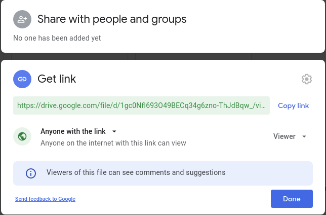

Created: 01-30-2021  
Updated: 01-30-2021

# RNA Seq Walkthrough
  
## Introduction
**Purpose:**  provide a  step-by-step, end-to-end RNA Seq analysis walkthrough.  

**Environment:** 
- All commands and scripts are made to run on the UCSC <code>courtyard</code> server, but should work in any bash environment.
<code>  
    OS:&nbsp;&nbsp;&nbsp;&nbsp;&nbsp; Red Hat 4.8.5-39  
    Python3: 3.6.8  
    R: &nbsp;&nbsp;&nbsp;&nbsp;&nbsp;&nbsp;3.6.0
</code>
- If running on Windows try the [Linux Subsystem for Windows](https://docs.microsoft.com/en-us/windows/wsl/install-win10) or a Docker instance. Either of these can be used to create Linux environments on Windows (albeit with some drawbacks). I suspect any of the recent Ubuntu releases (16.04, 18.04, 20.04) should work.  
- If using <code>courtyard</code> (or any remote server) it's **highly recommended** that you start commands in a <code>screen</code> environment. This is a very simple step and provides at least two substantial advantages:  
    1. A disruption to your <code>ssh</code> connection will not result in termination of whatever you're running. (Execution can take many hours to days so this is a likely occurence)
    2. You can open multiple windows in the same terminal and switch between them, running different commands in each.  

In the examples below I will always be working in a <code>screen</code> window, however, I will only demonstrate how to start one in section <code>0.0</code>.  
[More on using screens.](https://linuxize.com/post/how-to-use-linux-screen/)

**The Data**: I will be using paired-ended 151 bp Illumina sequence data starting in fastq.gz format.

  

## Step 0: Getting the Data

In cases where it seems to make sense I will include the generic command followed by the command I am using for actual data as an example. Otherwise I will just show the command I am using.

### 0.1 From an SFTP Server
0. Connect to courtyard, start a <code>screen</code> and navigate to your directory  
        
        $ ssh <username>@courtyard.gi.ucsc.edu
        $ ssh emalekos@courtyard.gi.ucsc.edu
        # enter password at prompt

        $ screen 
        $ cd <directory/to/transfer/data/to>
        $ cd /public/groups/carpenterlab/people/emalekos/

1. Connecting to data storage on remote server  

        $ sftp <username>@<hostname>
        $ sftp emalekos@sftp.genewiz.com
        # enter password at prompt

2. We are now in an <code>sftp</code> environment (<code>$</code> -> <code>sftp</code>). Navigate to data folder, use <code>ls</code> to list available directories

        sftp> ls
        30-422456969

        # Now I navigate to the folder I found above
        sftp> cd/30-422456969
        sftp> ls
        00_fastq

        # Found another folder, I'll navigate into that. 
        # This time I find the data files.
        sftp> cd 00_fastq/
        sftp> ls -lh

If you are in the data folder you should see something like:

        -rwxr--r--    ? 0        0            2.8G Jan  6 14:04 1M-Ctl-AM_R1_001.fastq.gz
        -rwxr--r--    ? 0        0            3.0G Jan  6 14:04 1M-Ctl-AM_R2_001.fastq.gz
        -rwxr--r--    ? 0        0            3.0G Jan  6 14:04 1M-LPS-AM_R1_001.fastq.gz
        -rwxr--r--    ? 0        0            3.1G Jan  6 14:04 1M-LPS-AM_R2_001.fastq.gz
        -rwxr--r--    ? 0        0            3.0G Jan  6 14:04 1W-Ctl-AM_R1_001.fastq.gz
        -rwxr--r--    ? 0        0            3.3G Jan  6 14:13 1W-Ctl-AM_R2_001.fastq.gz
        -rwxr--r--    ? 0        0            3.0G Jan  6 14:13 1W-LPS-AM_R1_001.fastq.gz
        -rwxr--r--    ? 0        0            3.2G Jan  6 14:13 1W-LPS-AM_R2_001.fastq.gz
        -rwxr--r--    ? 0        0            2.1G Jan  6 14:14 2M-CSE-AM_R1_001.fastq.gz
        -rwxr--r--    ? 0        0            2.3G Jan  6 14:14 2M-CSE-AM_R2_001.fastq.gz

3. To copy the files from this server to your workspace use the <code>get</code> command. Here I give some examples

        # To copy a single file
        sftp> get 1M-Ctl-AM_R1_001.fastq.gz

        # To copy all files
        sftp> get *

        # To copy all files ending in 'fastq.gz'
        sftp> get *fastq.gz

        # To copy all files starting with 'LPS' somewhere in the middle
        sftp> get *LPS*

        # To copy all files starting with 'LPS' and with '_R1' somewhere before the end
        sftp> get LPS*_R1*

**NOTE:** '<code>*</code>' performs wildcard expansion - it can fill in for any characters and is useful for pattern matching. When you use it it's good to check which patterns it's actually matching by double tapping the <code>Tab</code> key. This will list everything that matches. If you see the files you want press <code>Enter</code> to execute.
  
  

### 0.2 From Google Drive
You can use this method to transfer data files from your Google Drive account to <code>courtyard</code>. It works but is somewhat clunky, and there may be a better way. For instance this method transfers one file at a time, if all relevant files could be zipped together only one command would be required.

1. We will use the python package <code>gdown</code>. The first time you use this you will have to install it  
        
        pip3 install gdown --user

2. Get the share link for your Gdrive file
    - **IMPORTANT** - make sure the the file is accessible to "Anyone with the link"
    - The relevant part of the link is the string of characters between <code>/d/</code> and <code>/view/</code>
    - In the example below this is what we want: <code>1gc0Nfl693O49BECq34g6zno-ThJdBqw_</code>

    

3. Run with python3
    - Now you can start a python3 session and copy the files over

            $ python3

            # Now in python shell  
            >>> import gdown
            >>> url="https://drive.google.com/uc?id=1gc0Nfl693O49BECq34g6zno-ThJdBqw_"
            >>> output="desired_filename.fastq.gz"
            >>> gdown.download(url, output, quiet=False)

    - Alternatively you can open a text editor and write a script like this one. 

            import gdown
            url_prefix = "https://drive.google.com/uc?id="
            suffix = ".fastq.gz"
            filedict = {"file_1_1" : "1gc0Nfl693O49BECq34g6zno-ThJdBqw_",
                        "file_1_2" : "###################",
                        "file_2_1" : "###################",
                        "file_2_2" : "###################"}

            for key, value in filedict.items():
                gdown.download(url_prefix + value, key + suffix, quiet=False)

        After changing the entries in <code>filedict</code> to your desired filenames and corresponding links, run with:

            python3 file.py

  
  

### 0.3 Make Smaller Files for Pipeline Practice (OPTIONAL)
You may want to practice running through the pipeline with a reduced dataset. This would allow you to troubleshoot much more quickly than if you tried with all of your data at once. We can make some reduced, but still functional <code>fastq.gz</code> files with the following command

        zcat <file.in> | head -n <# of lines> | gzip > <file.out>

        zcat full_file.fastq.gz | head -n 10000000 | gzip > reqduced_file.gz
This example takes the first <code>10000000</code> lines of the input file (or the first <code>2500000</code> fastq entries). The resulting gzipped files is ~200 MB. Adjust <code><# of lines></code> as you see fit, but make it divisible by 4 to avoid cutting off fastq entries.